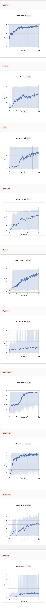

# Procgen competition

[Procgen](https://github.com/openai/procgen) environment efficiency and generalisation [challenge](https://www.aicrowd.com/challenges/neurips-2020-procgen-competition).

For training logs/ideas, see [`LOGS.md`](./LOGS.md).

## Docker

Install the docker image locally to test models:

- Install [nvidia docker](https://github.com/NVIDIA/nvidia-docker).
- Build the image: `docker build . -t procgen`
- Create the image: `docker create --gpus all --shm-size 10g -it -v /path/to/procgen:/home/aicrowd/ --name pr procgen bash`
- Start and attach to the image: `docker start pr && docker attach pr`

## Sagemaker

I used AWS sagemaker for training full models. See the `sagemaker` directory.

## Results

